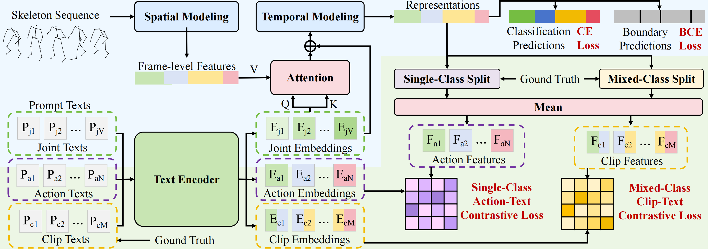

# <p align=center> Language-Assisted Skeleton Action Understanding for <br>Skeleton-Based Temporal Action Segmentation</p>

> **Authors:**
> Haoyu Ji,
> Bowen Chen,
> Xinglong Xu,
> Weihong Ren,
> Zhiyong Wang*,
> Honghai Liu
> (*Corresponding author)


> **Abstract:** *Skeleton-based Temporal Action Segmentation (STAS) aims at densely segmenting and classifying human actions in long untrimmed skeletal motion sequences. Existing STAS methods primarily model the spatial dependencies among joints and the temporal relationships among frames to generate frame-level one-hot classifications. However, these research overlook the deep mining of semantic relations among joints as well as actions at a linguistic level, which limits the comprehensiveness of skeleton action understanding. In this work, we propose a Language-assisted Skeleton Action Understanding (LaSA) method that leverages language modality to assist in learning semantic relationships among joints and actions. Specifically, in terms of joint relationships, the Joint Relationships Establishment (JRE) module establishes correlations among joints in the feature sequence by applying attention between joint texts and embedding joint texts as positional embeddings to differentiate distinct joints. Regarding action relationships, the Action Relationships Supervision (ARS) module enhances the discrimination across action classes through contrastive learning of single-class action-text pairs and temporally models the semantic associations of adjacent actions by contrasting mixed-class clip-text pairs. Performance evaluation on five public datasets demonstrates that LaSA has achieved state-of-the-art performance.* 

<p align="center">
     <br />
    <em> 
    Figure 1: Overview of the LaSA.
    </em>
</p>


## Introduction
The PyTorch code serves as the authoritative implementation of the ECCV 2024 paper: "Language-Assisted Skeleton Action Understanding for Skeleton-Based Temporal Action Segmentation."
> * Our proposed LaSA leverages the text encoder of CLIP to enhance the effectiveness of action segmentation..
> * This implementation code encompasses both training `train.py` and evaluation `evaluation.py` procedures.
> * A single GPU (NVIDIA RTX 3090) can perform all the experiments.

## Enviroment
Pytorch == `1.10.1+cu111`, 
torchvision == `0.11.2`, 
python == `3.8.13`, 
CUDA==`11.4`

### Enviroment Setup
Within the newly instantiated virtual environment, execute the following command to install all dependencies listed in the `requirements.txt` file.

``` python
pip install -r requirements.txt
```

## Datasets
All datasets can be downloaded from
[GoogleDrive](https://drive.google.com/file/d/1JAX8OaIJQ7ZEaIg61axJoHCw1GZkim9Q/view?usp=sharing) or [BaiduNetdisk](https://pan.baidu.com/s/1PC0Pegpg7tfGyCVjbHbu6w?pwd=mrid). (~4.3GB)

**Note**：These datasets have been openly collected, curated, and subsequently released on a cloud platform by the authors of "A Decoupled Spatio-Temporal Framework for Skeleton-based Action Segmentation", rather than provided by the authors of the present paper.

Gratitude is extended to the respective authors for their contributions in providing and consolidating these datasets.


## Preparation

Orgnize the folder in the following structure (**Note**: please check it carefully):

> * If the file `clip/models/VIT-B-32.pt` is not present, it will be automatically downloaded when running the code. 
> * The `result` folder and its contents will be automatically generated during code execution (`result` is the default storage path for results).


```
|-- clip/
|   |-- models/
|   |   -- VIT-B-32.pt
|-- config/
|   |-- MCFS-130/
|   |   -- config.yaml
|-- csv/
|-- dataset/
|   |-- MCFS-130/
|   |   |-- features/
|   |   |-- groundTruth/
|   |   |-- gt_arr/
|   |   |-- gt_boundary_arr/
|   |   |-- splits/
|   |   |-- mapping.txt
|-- libs/
|-- prompt/
|-- result/
|   |-- MCFS-130/
|   |   |-- split1/
|   |   |   |-- best_test_model.prm
|-- text/
|-- utils/
|-- train.py
|-- evaluate.py

```

## Get Started

### Training

To train our model on different datasets, use the following command:

```shell
python train.py --dataset PKU-subject --cuda 0
```

Here, `--dataset` can be one of the following: LARA, MCFS-22, MCFS-130, PKU-subject, or PKU-view. 
`--cuda` specifies the ID number of the GPU to be used for training. 
Additionally, you can use `--result_path` to specify the output path, which defaults to `./result`.

If you wish to modify other parameters, please make the necessary changes in `csv/PKU-subject/config.yaml`.


### Evaluation

To evaluate the performance of the results obtained after running the training:

```shell
python evaluate.py --dataset PKU-subject --cuda 0
```

Here, `--dataset` and `--cuda` have the same meaning as in the training command. 
Note that if you specify the evaluation `--result_path`, it should match the training `--result_path`, which defaults to `./result`.


## Acknowledgement
The LaSA model and code are built upon [DeST](https://github.com/lyhisme/dest). 
Additionally, the BRB branch we utilized is derived from [ASRF](https://github.com/yiskw713/asrf). 

We extend our gratitude to the authors for openly sharing their code and datasets.

## Citation
If this code is useful in your research we would kindly ask you to cite our paper.
```
@inproceedings{LaSA_2024ECCV,
 title={Language-Assisted Skeleton Action Understanding for Skeleton-Based Temporal Action Segmentation},
 author={Ji, Haoyu and Chen, Bowen and Xu, Xinglong and Ren, Weihong and Wang, Zhiyong and Liu, Honghai},
 booktitle={ECCV},
 year={2024}
 organization={Springer}
}
```

## License
This repository is released under the [MIT](https://choosealicense.com/licenses/mit/) License.

## Contact
If you have any other questions, please email jihaoyu1224@gmail.com  and we typically respond within a few days.
